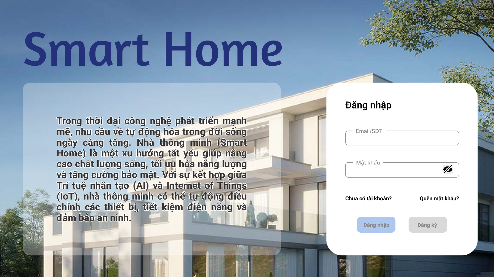

# Smart Home

In the era of rapid technological development, the demand for automation in daily life is increasing. Smart Home is an inevitable trend that helps improve quality of life, optimize energy usage, and enhance security. With the combination of Artificial Intelligence (AI) and the Internet of Things (IoT), smart homes can automatically adjust devices, save energy, and ensure security. Therefore, the research team has decided to choose this topic to study and develop a modern and efficient smart home system.




## Technology Stack
- Front-end: ReactJS, ...
- Back-end: FastAPI, ....
- Database: MongoDB.


## Installation
To use the application, you can follow the following steps:


### Pre-Requisites:
1. Install Git Version Control
[ https://git-scm.com/downloads ]

2. Install Python (v3.12.1 recommended)
[ https://www.python.org/downloads/ ]

3. Install Pip (Package Manager)
[ https://pip.pypa.io/en/stable/installation/ ]

4. Install Node.js (v20)
[ https://nodejs.org/en/download ]


### Installation
**1. Create a Folder where you want to save the project**

**2. Create a Virtual Environment and Activate**

Install Virtual Environment First
```
pip install virtualenv
```

Create Virtual Environment

For Windows
```
python -m venv venv
```
For Mac
```
python3 -m venv venv
```
For Linux
```
virtualenv .
```

Activate Virtual Environment

For Windows
```
venv\Scripts\activate
```

For Mac
```
source venv/bin/activate
```

For Linux
```
source bin/activate
```

**3. Clone this project**

Open a terminal at a directory of your choice and enter these commands (change the folder name if you want to):
```
  git clone https://github.com/AsunaYuuki197/smart-home.git
  cd smart-home
```

Inside **smart-home** folder, you will see several subfolders: *frontend*, *backend*, etc.

### Install dependencies

You will have to install all the dependencies of our project. Let's go to the "backend" directory first and **read the README** for more information:
```
  cd backend
```

Then, go to the "frontend" directory and do the same thing by entering these commands:
```
  cd frontend
  npm install
```

You have installed all the dependencies.

### Set up a database server

To be written later

## Run the application

### Start each folder separately
Start two terminal instances in the **smart-home** directory. For the first instance, run these commands:
```
  cd backend
  python server.py
```

For the second one, run these commands:
```
  cd frontend
  npm run dev
```

The application should be starting. The ReactJS application will run on http://localhost:3000 and the FastAPI application will run on http://localhost:8000.

To login:
* Username: `admin`
* Password: `123456`

You are now ready to explore our application!

<!-- ### Or use our web deployment 😀 
The application is running in [Link to the website](....)

To login:
* Username: `admin`
* Password: `123456`

You are now ready to explore our application! -->


## Contributor
Our members of the team:
* Nguyễn Khắc Duy - 2210517
* Nguyễn Quang Huy - 2211234
* Đào Ngọc Minh - 2212023
* Kiều Tâm Hậu - 2210961
* Nguyễn Trọng Tài - 2212995
